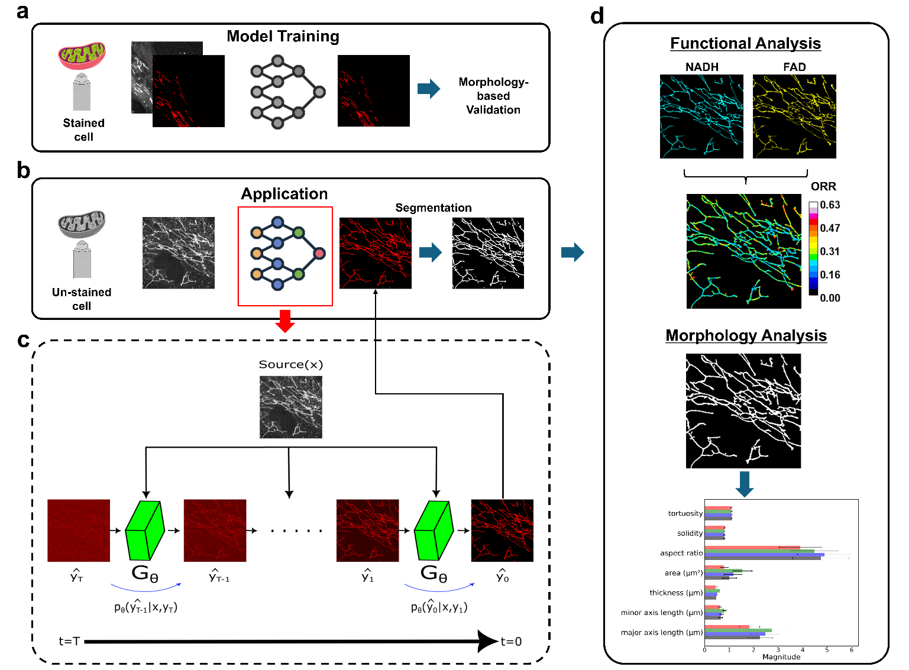

# RedoxSegNet 

Official PyTorch implementation of RedoxSegNet  described in the [paper]().

Kideog Bae, Muzaffer Özbey, Alexander Ho, Edita Aksamitiene, Kevin K Tan, Janet E Sorrells, Rishyashring R Iyer, Mark A. Anastasio, Stephen A. Boppart "Label-free Segmentation of Mitochondria for Simultaneous Morphological and Metabolic Studies"



## Dependencies

```
python>=3.6.9
torch>=1.7.1
torchvision>=0.8.2
cuda=>11.2
ninja
python3.x-dev (apt install, x should match your python3 version, ex: 3.8)
```

## Installation
- Clone this repo:
```bash
git clone https://github.com/comp-imaging-sci/RedoxSegNet 
cd RedoxSegNet 
```

## Dataset
You should structure your aligned dataset in the following way:

```
/dataset_path/
  │  ├── train
  |   - 1.tif
  |   - 2.tif
  |   - ...
  │  ├── val
  │  └── test

 
```

## Train

<br />

```
python train_ddgan_translation_microscopy.py --data_dir /folder/path/for/data --image_size 256 --exp exp_RedoxSegNet --num_channels 2 --num_channels_dae 64 --ch_mult 1 1 2 2 4 4 --num_timesteps 4 --num_res_blocks 2 --batch_size 8 --num_epoch 200 --ngf 64 --embedding_type positional --use_ema --r1_gamma 2. --z_emb_dim 256 --lr_d 1e-4 --lr_g 2e-4 --lazy_reg 10  --num_process_per_node 1 --save_content --checkpoint_dir /checkpoints/runs --input_selection --input_channels 0 --out_channels 3  --local_rank 0
```

### Argument descriptions

| Argument            | Description                                                                  |
|---------------------|------------------------------------------------------------------------------|
| `--data_dir`        | Root directory path of the dataset folder.                                   |
| `--exp`             | Name of the experiment, used for storing model checkpoints.                  |
| `--image_size`      | Size of image.                                                               |
| `--num_channels`    | Number of channels for generator input(summation of input and target channel)|
| `--num_timesteps`   | Number of diffusion steps.                                                   |
| `--checkpoint_dir`  | Directory where model checkpoints are saved.                                 |
| `--lr_d`            | Initial learning rate for the optimizer of discriminator.                    |
| `--lr_g`            | Initial learning rate for the optimizer of generator.                        |
| `--input_selection` | Indicate the selection of specific channels in source data.                  |
| `--input_channels`  | Channel index of source data, list with space (--input_channels 0 1 3).      |
| `--out_channels`    | Channel index of target data, list with space (--out_channels 3 4).          |
| `--local_rank`      | GPU selection.                                                               |


## Test

<br />

```
python test_ddgan_translation_inference.py --data_dir /folder/path/for/test/data --result_dir /folder/path/for/result/ --image_size 256 --num_channels 2 --num_channels_dae 64 --ch_mult 1 1 2 2 4 4 --num_timesteps 4 --num_res_blocks 2 --batch_size 8 --input_selection --input_channels 0 --num_target_channels 1 --checkpoint_model /checkpoints/runs/exp_RedoxSegNet/netG_100.pth
```

<br />


### Argument descriptions

| Argument                   | Description                                                                  |
|----------------------------|----------------------------------------------------------------------------- |
| `--data_dir`               | Root directory path of the dataset folder.                                   |
| `--result_dir`             | Directory where results are saved.                                           |
| `--image_size`             | Size of image.                                                               |
| `--num_channels`           | Number of channels for generator input(summation of input and target channel)|
| `--num_timesteps`          | Number of diffusion steps.                                                   |
| `--input_selection`        | Indicate the selection of specific channels in source data.                  |
| `--input_channels`         | Channel index of source data, list with space (--input_channels 0 1 3).      |
| `--num_target_channels`    | Number of channels in target image.                                          |


## Acknowledgments

This code uses libraries from [SynDiff](https://github.com/icon-lab/SynDiff) and [DD-GAN](https://github.com/NVlabs/denoising-diffusion-gan) repository.
